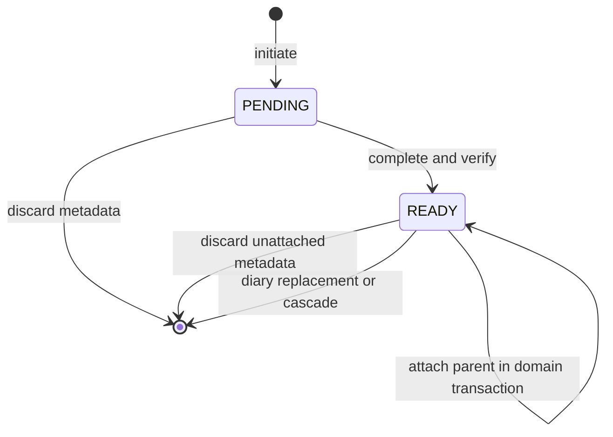

# 비공개 미디어 lifecycle

`media`는 Cloudflare R2 연결 자체보다 upload가 어떤 business object에 어떤 규칙으로 붙을 수
있는지를 소유하는 얇은 business module이다. R2 SDK/client와 presign, inspect, copy, delete는
`media.internal` adapter에 둔다. API 정본은 [OpenAPI](../../contracts/openapi-v2.yaml), 전체
business rule은 [불변식](invariants.md)을 따른다.

## 정책

| Purpose | 허용 kind/type | 개별 최대 | Parent 제한 |
| --- | --- | --- | --- |
| `SCORE_CHANGE` | JPEG, PNG, WebP image | 10 MiB | Image 0~1개 |
| `SCORE_CHANGE_COMMENT` | 위 image 또는 MP4, WebM, QuickTime video | Image 10 MiB, video 100 MiB | Image 0~4개 또는 video 1개 |
| `DIARY_ENTRY` | 위 image 또는 MP4, WebM, QuickTime video | Image 10 MiB, video 100 MiB | Image 0~4개 또는 video 1개 |

Filename은 path를 제거한 nonblank 최대 255 code point이고 control character를 허용하지 않는다.
Content type parameter는 제거하고 lowercase로 normalize한다. Expected size는 1 이상이며 complete
뒤 actual size와 정확히 같아야 한다.

기본 upload URL TTL은 900초, download URL TTL은 300초다. 설정 허용 범위는 60~3600초다.
Presigned URL과 signature query는 credential이므로 cache와 log에 남기지 않는다.

## 상태 model

상태는 `PENDING`, `READY` 둘뿐이다.

- `PENDING`: Parent, actual size와 ready time이 없고 position은 0
- Parentless `READY`: Object 검증은 끝났지만 business parent에 붙지 않은 상태
- Parented `READY`: Attachment. Parent FK와 position이 연결을 표현

별도 finalizing/attached/deleting 상태, expiry column, claim token, cleanup lease와 tombstone은
두지 않는다. 작은 private workload에서 durable cleanup state machine의 비용보다 orphan을
private하게 수용하는 편이 단순하기 때문이다.

Complete, discard, attach와 replace는 같은 upload row에 비관적 락을 사용한다. Upload가
single-use이고 complete에 R2 inspect/copy가 포함돼 version mismatch 뒤 외부 side effect를
안전하게 되돌릴 수 없기 때문이다. Provider workflow가 idempotent하거나 명시적 보상으로 이
경계를 분리할 수 있게 되면 락 범위를 다시 검토한다.

## Initiate

`POST /api/v2/media-uploads`는 Basic actor를 uploader로 사용한다.

1. Purpose, kind, filename, content type과 expected size를 검증한다.
2. UUID와 private staging object key를 만들고 `PENDING` row를 저장한다.
3. Exact content type/size용 short-lived PUT URL을 발급한다.

Media provider가 꺼져 있거나 signing/storage가 실패하면 성공으로 보이지 않는다. 각 initiate는
새 UUID를 만들며 quota/idempotency ledger는 없다. Client는 R2 PUT에 API Basic header를 보내지
않는다.

## Complete

`POST /api/v2/media-uploads/{id}/complete`는 uploader만 호출한다.

1. Row를 `FOR UPDATE`로 잠그고 owner, parentless `PENDING`과 purpose를 검증한다.
2. Staging object의 존재, size, content type과 leading-byte signature를 검사한다.
3. Private final key로 copy한다.
4. Final object를 다시 inspect한다.
5. 같은 transaction에서 object key, actual size, ready time과 `READY`를 저장한다.
6. Commit 뒤 staging object 삭제를 best effort로 시도한다.

검사, copy 또는 DB transaction이 실패하면 metadata는 `PENDING`으로 남아 retry할 수 있다.
Copy 결과가 불명확한 뒤 DB commit이 실패하면 참조되지 않는 final object가 남을 수 있다.
Attachment 정본은 DB이며 이 상황을 보완하려 custom CAS/lease/reconciliation을 추가하지 않는다.

## Attach와 replace

`MediaAttachmentMutation`은 relationship/diary caller transaction에
`Propagation.MANDATORY`로 참여한다.

- UUID row를 잠그고 중복, uploader, purpose, parentless `READY`, kind mix와 count를 다시
  검증한다.
- Score change는 image 하나를 position 0에 붙인다.
- Score comment는 request 순서대로 image 최대 네 개 또는 video 하나를 붙인다.
- Diary create는 exact list를 붙인다.
- Diary update에서 `mediaUploadIds`가 생략되면 기존 list를 유지하고, 빈 list면 모두 제거하며,
  값이 있으면 request order가 final list다.
- 같은 diary에 붙은 row는 유지할 수 있고 빠진 row는 DB에서 삭제한다.
- Parent write, attachment FK/position과 event publication은 함께 commit하거나 rollback한다.

DB row 삭제는 R2 object 삭제를 보장하지 않는다. Read API는 parented `READY`만 신뢰하므로
남은 object가 application data로 다시 나타나지는 않는다.

## Read와 download

Business response는 parent ID와 uploader까지 검증된 parented `READY` metadata만 반환한다.
Position은 0부터 연속이어야 하며 kind/count/type/size가 stored policy와 다르면 부분 결과 대신
service unavailable로 취급한다.

`GET /api/v2/media-attachments/{id}/download-url`은 canonical participant가 parented `READY`
attachment를 요청할 때만 private GET URL을 발급한다. Parentless upload나 불일치 topology를
노출하지 않는다. Response는 `Cache-Control: no-store`다.

## Discard와 orphan

`DELETE /api/v2/media-uploads/{id}`는 uploader 소유의 parentless `PENDING` 또는 `READY` row를
삭제한다. Missing/repeated discard는 성공 no-op이고 parented attachment는 discard할 수 없다.
DB commit 뒤 staging/final object 삭제를 best effort로 수행한다.

다음 private orphan은 허용한다.

- 오래된 parentless `PENDING` 또는 `READY`
- DB transaction 뒤 삭제에 실패한 staging/final object
- Diary replacement/delete 뒤 남은 final object

Bucket 규모, 비용이나 privacy 위험이 이 선택을 감당하지 못한다는 증거가 생기면 이 문서와
관련 schema·운영 문서에 retention, list/delete 권한, idempotency, recovery와 observability의
선택 근거를 함께 정리한다.

## 검증

- H2: Policy, owner/purpose/state/count/order, transaction rollback과 storage test double
- PostgreSQL Testcontainers: Constraint, partial unique index, row lock과 transaction 의미
- Staging R2: Presign, PUT, inspect/signature, copy, download와 best-effort delete

Docker가 없을 때 PostgreSQL 의미를 H2로 대체하거나 관련 test를 skip하지 않는다.
